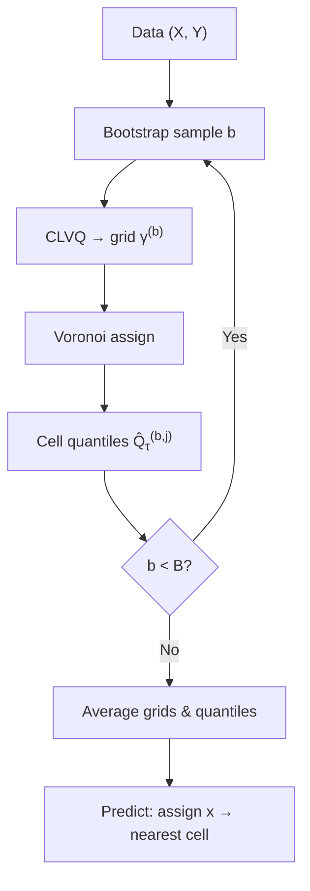

# Nonparametric Quantile Estimation via Optimal Quantization

## Beyond Linearity

The linear quantile regression model \\(Q_\tau(Y \mid X) = X^\top \beta(\tau)\\)
is flexible and interpretable, but it assumes the conditional quantile is a
**linear function** of the covariates.  When the relationship is nonlinear —
threshold effects, saturation, interactions — a different approach is needed.

The **quantization-based estimator** of Charlier, Paindaveine & Saracco (2015)
provides a fully nonparametric alternative.  It makes no assumption about the
functional form of \\(Q_\tau(Y \mid X = x)\\) and works by:

1. Partitioning the covariate space into Voronoi cells
2. Estimating the conditional quantile within each cell from the data
3. Averaging over multiple random partitions for stability

---

## Optimal Quantization

**Quantization** approximates a continuous distribution by a discrete
one with \\(N\\) support points, chosen to minimise the expected \\(L_p\\)
distance between a random vector and its nearest grid point:

\[
\hat\gamma_N = \arg\min_{\gamma = \{c_1, \dots, c_N\}}
E\left[\min_{j} \|X - c_j\|^p\right]
\]

This is the same idea as \\(k\\)-means clustering (\\(p = 2\\)) but
applied to probability distributions rather than datasets.  The grid
points \\(c_1, \dots, c_N\\) are called **codebook vectors** or
**quantization centroids**.

### CLVQ Algorithm

The Competitive Learning Vector Quantization (CLVQ) algorithm
constructs the optimal grid via stochastic gradient descent.  Starting
from random initial positions, it processes observations one at a time:

1. Draw a stimulus \\(x\\) from the data (with replacement)
2. Find the nearest grid point \\(c_{j^*}\\)
3. Move \\(c_{j^*}\\) toward \\(x\\) with a decaying step size:

\[
c_{j^*} \leftarrow c_{j^*} + \gamma_t \cdot \|x - c_{j^*}\|^{p-2}
(x - c_{j^*})
\]

The step size \\(\gamma_t\\) decays as \\(\gamma_0 \cdot a / (a + \gamma_0 \cdot b \cdot t)\\)
with \\(a = 4N\\) and \\(b = \pi^2 N^{-2}\\), ensuring convergence
while allowing early exploration.

After one full pass through the data, the grid points have converged
to an \\(L_p\\)-optimal quantization of the covariate distribution.

---

## Voronoi Tessellation

The optimal grid induces a **Voronoi partition** of the covariate
space.  Each observation \\((x_i, y_i)\\) is assigned to the cell of
its nearest grid point:

\[
\text{cell}(x_i) = \arg\min_{j \in \{1, \dots, N\}} \|x_i - c_j\|
\]

Within each cell \\(j\\), the \\(\tau\\)-quantile of \\(Y\\) is estimated
from the \\(y_i\\) values of observations in that cell:

\[
\hat Q_\tau^{(j)} = \text{quantile}_\tau\{y_i : x_i \in \text{cell}_j\}
\]

This gives a **piecewise-constant** estimate of the conditional
quantile function: within each Voronoi cell, the prediction is the
cell's sample quantile.

---

## Bootstrap Averaging

A single CLVQ grid is random (it depends on the bootstrap sample and
the initial grid positions).  To obtain stable estimates, the algorithm
constructs \\(B\\) independent grids and averages the cell-level
quantile estimates.

For each grid \\(b = 1, \dots, B\\):

1. Bootstrap a sample of size \\(n\\) from the data
2. Run CLVQ to obtain grid \\(\gamma^{(b)}\\)
3. Assign all \\(n\\) training observations to cells
4. Compute cell quantiles \\(\hat Q_\tau^{(b,j)}\\)

The final grid is the centroid of all \\(B\\) grids:

\[
\bar\gamma = \frac{1}{B} \sum_{b=1}^{B} \gamma^{(b)}
\]

and the final cell quantiles are averaged across the \\(B\\) grids.

At prediction time, a new \\(x\\) is assigned to its nearest cell in
\\(\bar\gamma\\) and the corresponding averaged quantile is returned.

---

## Algorithm Summary



---

## Properties

### Advantages

- **No functional form assumption** — the conditional quantile can be
  any function of \\(X\\), including discontinuous or non-monotonic
- **Works in any dimension** — the CLVQ algorithm and Voronoi
  partition generalise naturally to \\(d\\)-dimensional covariates
- **Bootstrap averaging** gives smooth, stable estimates despite
  the stochastic grid construction
- **Interpretable** — each Voronoi cell is a region of covariate
  space with its own quantile estimate, which is easy to visualise
  and explain

### Limitations

- **Curse of dimensionality** — for large \\(d\\), many cells may
  be empty or contain few observations, degrading the quality of
  cell-level quantile estimates
- **Not a linear model** — cannot produce coefficient vectors or
  standard errors in the usual regression sense
- **Grid resolution** — \\(N\\) must be chosen by the user.  Too small
  gives a coarse partition; too large gives many near-empty cells

### Choosing \\(N\\)

The number of grid points \\(N\\) controls the resolution of the
partition.  Rules of thumb:

| \\(n\\) (sample size) | \\(d\\) (dimensions) | Suggested \\(N\\) |
|----------------------|---------------------|-------------------|
| 100–500 | 1 | 10–20 |
| 500–5,000 | 1 | 20–50 |
| 100–500 | 2–5 | 5–15 |
| 500–5,000 | 2–5 | 15–30 |

---

## Implementation in Pinball

```python
from pinball.nonparametric import QuantizationQuantileEstimator

model = QuantizationQuantileEstimator(
    tau=0.5,          # quantile level
    N=20,             # grid points
    n_grids=50,       # bootstrap grids (like bagging)
    p=2,              # L_p norm (2 = Euclidean)
    random_state=42,  # for reproducibility
)
model.fit(X, y)
y_hat = model.predict(X_new)
```

### sklearn Compatibility

The estimator is fully sklearn-compatible — it passes all 52
`check_estimator` checks and can be used in pipelines, grid search,
and cross-validation:

```python
from sklearn.pipeline import Pipeline
from sklearn.preprocessing import StandardScaler
from sklearn.model_selection import cross_val_score

pipe = Pipeline([
    ("scale", StandardScaler()),
    ("quant", QuantizationQuantileEstimator(tau=0.5, N=20)),
])

scores = cross_val_score(pipe, X, y, cv=5)
```

### Low-level API

For fine-grained control, the building blocks are available directly:

```python
from pinball.nonparametric.quantization import (
    choice_grid,       # construct CLVQ grids
    voronoi_assign,    # assign points to cells
    cell_quantiles,    # compute quantiles per cell
    predict_quantiles, # predict at new points
)

# Build 50 grids with N=20 centroids
grids = choice_grid(X.T, N=20, n_grids=50, random_state=42)

# Use the optimal grids
grid = grids["optimal_grid"]  # shape (N, n_grids)
```

---

## References

1. Charlier, I., Paindaveine, D. and Saracco, J. (2015).
   "Conditional quantile estimation through optimal quantization."
   *Journal of Statistical Planning and Inference* 156, 14–30.

2. Pagès, G. (1998). "A space quantization method for numerical
   integration." *Journal of Computational and Applied Mathematics*
   89(1), 1–38.

3. Charlier, I., Paindaveine, D. and Saracco, J. (2014).
   "QuantifQuantile: Estimation of Conditional Quantiles using
   Optimal Quantization." R package.
